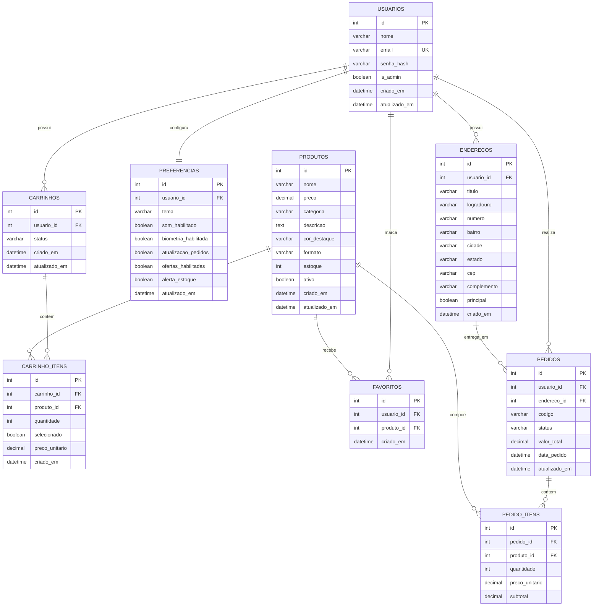

# 5.1 Modelagem de Banco de Dados

Esta secao descreve a modelagem do banco de dados proposta para sustentar a aplicacao Benucci. A estrutura foi definida com base nas funcionalidades ja presentes no projeto, como autenticacao de usuarios, cadastro e gerenciamento de produtos, carrinho, favoritos, endereco de entrega, historico de pedidos e preferencias do usuario.

O objetivo dessa modelagem e garantir organizacao, integridade e consistencia dos dados, permitindo que a aplicacao evolua de um prototipo local para uma solucao com persistencia em banco de dados relacional, como MySQL ou PostgreSQL.

## Modelo Entidade-Relacionamento (ER)

## Entidades e atributos

### 1. Usuario
Representa as pessoas que acessam o sistema, incluindo clientes e administradores.

| Atributo | Tipo | Descricao |
|---|---|---|
| `id` | INT | Identificador unico do usuario |
| `nome` | VARCHAR(120) | Nome do usuario |
| `email` | VARCHAR(150) | Email de login, unico no sistema |
| `senha_hash` | VARCHAR(255) | Senha armazenada de forma segura |
| `is_admin` | BOOLEAN | Indica se o usuario possui perfil administrativo |
| `criado_em` | DATETIME | Data de criacao do registro |
| `atualizado_em` | DATETIME | Data da ultima atualizacao |

### 2. Endereco
Armazena os enderecos associados a cada usuario para entrega de pedidos.

| Atributo | Tipo | Descricao |
|---|---|---|
| `id` | INT | Identificador unico do endereco |
| `usuario_id` | INT | Chave estrangeira para `usuarios.id` |
| `titulo` | VARCHAR(80) | Nome de referencia do endereco, como Casa ou Trabalho |
| `logradouro` | VARCHAR(150) | Rua ou avenida |
| `numero` | VARCHAR(20) | Numero do endereco |
| `bairro` | VARCHAR(80) | Bairro |
| `cidade` | VARCHAR(80) | Cidade |
| `estado` | VARCHAR(2) | UF do estado |
| `cep` | VARCHAR(10) | CEP do endereco |
| `complemento` | VARCHAR(120) | Informacao complementar |
| `principal` | BOOLEAN | Indica se e o endereco padrao |
| `criado_em` | DATETIME | Data de cadastro |

### 3. Preferencia
Armazena configuracoes de personalizacao e notificacao do usuario.

| Atributo | Tipo | Descricao |
|---|---|---|
| `id` | INT | Identificador unico |
| `usuario_id` | INT | Chave estrangeira para `usuarios.id` |
| `tema` | VARCHAR(20) | Tema selecionado, como claro ou escuro |
| `som_habilitado` | BOOLEAN | Ativa ou desativa sons no app |
| `biometria_habilitada` | BOOLEAN | Define uso de biometria |
| `atualizacao_pedidos` | BOOLEAN | Permite notificacoes de pedido |
| `ofertas_habilitadas` | BOOLEAN | Permite comunicacoes promocionais |
| `alerta_estoque` | BOOLEAN | Alerta quando produtos voltam ao estoque |
| `atualizado_em` | DATETIME | Data da ultima atualizacao |

### 4. Produto
Representa os itens artesanais exibidos e vendidos pela aplicacao.

| Atributo | Tipo | Descricao |
|---|---|---|
| `id` | INT | Identificador unico do produto |
| `nome` | VARCHAR(120) | Nome do produto |
| `preco` | DECIMAL(10,2) | Valor unitario |
| `categoria` | VARCHAR(80) | Categoria do produto |
| `descricao` | TEXT | Descricao detalhada |
| `cor_destaque` | VARCHAR(20) | Cor usada na interface |
| `formato` | VARCHAR(40) | Tipo visual ou formato do item |
| `estoque` | INT | Quantidade disponivel |
| `ativo` | BOOLEAN | Define se o produto esta disponivel |
| `criado_em` | DATETIME | Data de criacao |
| `atualizado_em` | DATETIME | Data da ultima atualizacao |

### 5. Carrinho
Representa o carrinho ativo do usuario antes da finalizacao da compra.

| Atributo | Tipo | Descricao |
|---|---|---|
| `id` | INT | Identificador unico do carrinho |
| `usuario_id` | INT | Chave estrangeira para `usuarios.id` |
| `status` | VARCHAR(20) | Estado do carrinho, como ativo ou finalizado |
| `criado_em` | DATETIME | Data de criacao |
| `atualizado_em` | DATETIME | Data da ultima atualizacao |

### 6. CarrinhoItem
Guarda os produtos adicionados em cada carrinho.

| Atributo | Tipo | Descricao |
|---|---|---|
| `id` | INT | Identificador unico |
| `carrinho_id` | INT | Chave estrangeira para `carrinhos.id` |
| `produto_id` | INT | Chave estrangeira para `produtos.id` |
| `quantidade` | INT | Quantidade do produto no carrinho |
| `selecionado` | BOOLEAN | Indica se o item esta marcado para compra |
| `preco_unitario` | DECIMAL(10,2) | Preco registrado no momento da adicao |
| `criado_em` | DATETIME | Data de inclusao no carrinho |

### 7. Favorito
Representa a relacao entre usuarios e produtos salvos como favoritos.

| Atributo | Tipo | Descricao |
|---|---|---|
| `id` | INT | Identificador unico |
| `usuario_id` | INT | Chave estrangeira para `usuarios.id` |
| `produto_id` | INT | Chave estrangeira para `produtos.id` |
| `criado_em` | DATETIME | Data da marcacao como favorito |

### 8. Pedido
Registra as compras realizadas pelos usuarios.

| Atributo | Tipo | Descricao |
|---|---|---|
| `id` | INT | Identificador unico do pedido |
| `usuario_id` | INT | Chave estrangeira para `usuarios.id` |
| `endereco_id` | INT | Chave estrangeira para `enderecos.id` |
| `codigo` | VARCHAR(20) | Codigo visivel do pedido, como `#BN-2031` |
| `status` | VARCHAR(30) | Situacao do pedido, como entregue ou em separacao |
| `valor_total` | DECIMAL(10,2) | Valor total da compra |
| `data_pedido` | DATETIME | Data de realizacao do pedido |
| `atualizado_em` | DATETIME | Data da ultima atualizacao |

### 9. PedidoItem
Detalha os produtos contidos em cada pedido.

| Atributo | Tipo | Descricao |
|---|---|---|
| `id` | INT | Identificador unico |
| `pedido_id` | INT | Chave estrangeira para `pedidos.id` |
| `produto_id` | INT | Chave estrangeira para `produtos.id` |
| `quantidade` | INT | Quantidade comprada |
| `preco_unitario` | DECIMAL(10,2) | Preco do item no momento da compra |
| `subtotal` | DECIMAL(10,2) | Valor parcial do item |

## Relacionamentos

- Um `usuario` pode possuir varios `enderecos`.
- Um `usuario` possui um conjunto de `preferencias`.
- Um `usuario` pode possuir um ou mais `carrinhos`, embora normalmente apenas um esteja ativo.
- Um `carrinho` possui varios `carrinho_itens`.
- Um `produto` pode estar presente em varios `carrinho_itens`.
- Um `usuario` pode favoritar varios `produtos`, e um `produto` pode ser favoritado por varios `usuarios`.
- Um `usuario` pode realizar varios `pedidos`.
- Um `pedido` utiliza um `endereco` de entrega.
- Um `pedido` possui varios `pedido_itens`.
- Um `produto` pode aparecer em varios `pedido_itens`.

## Chaves primarias e estrangeiras

### Chaves primarias

- `usuarios.id`
- `enderecos.id`
- `preferencias.id`
- `produtos.id`
- `carrinhos.id`
- `carrinho_itens.id`
- `favoritos.id`
- `pedidos.id`
- `pedido_itens.id`

### Chaves estrangeiras

- `enderecos.usuario_id` referencia `usuarios.id`
- `preferencias.usuario_id` referencia `usuarios.id`
- `carrinhos.usuario_id` referencia `usuarios.id`
- `carrinho_itens.carrinho_id` referencia `carrinhos.id`
- `carrinho_itens.produto_id` referencia `produtos.id`
- `favoritos.usuario_id` referencia `usuarios.id`
- `favoritos.produto_id` referencia `produtos.id`
- `pedidos.usuario_id` referencia `usuarios.id`
- `pedidos.endereco_id` referencia `enderecos.id`
- `pedido_itens.pedido_id` referencia `pedidos.id`
- `pedido_itens.produto_id` referencia `produtos.id`

## Regras de integridade

- O campo `email` na tabela `usuarios` deve ser unico.
- Um endereco nao pode existir sem estar vinculado a um usuario.
- Um item de carrinho nao pode existir sem um carrinho e um produto validos.
- Um item de pedido nao pode existir sem um pedido e um produto validos.
- O estoque do produto nao deve aceitar valores negativos.
- A quantidade em `carrinho_itens` e `pedido_itens` deve ser maior que zero.
- A tabela `favoritos` deve impedir duplicidade da combinacao `usuario_id` e `produto_id`.
- A tabela `preferencias` deve manter relacao 1:1 com `usuarios`, impedindo mais de um registro de preferencias por usuario.

## Justificativa da modelagem

A modelagem foi estruturada para refletir as principais funcionalidades do projeto Benucci:

- autenticacao e perfil de usuario;
- gerenciamento de produtos pelo administrador;
- selecao e armazenamento de produtos no carrinho;
- marcacao de favoritos;
- persistencia de enderecos de entrega;
- historico e acompanhamento de pedidos;
- configuracoes personalizadas da conta.

Essa organizacao facilita consultas, manutencao dos dados e expansao futura do sistema, como inclusao de pagamentos, cupons, notificacoes e relatorios administrativos.
